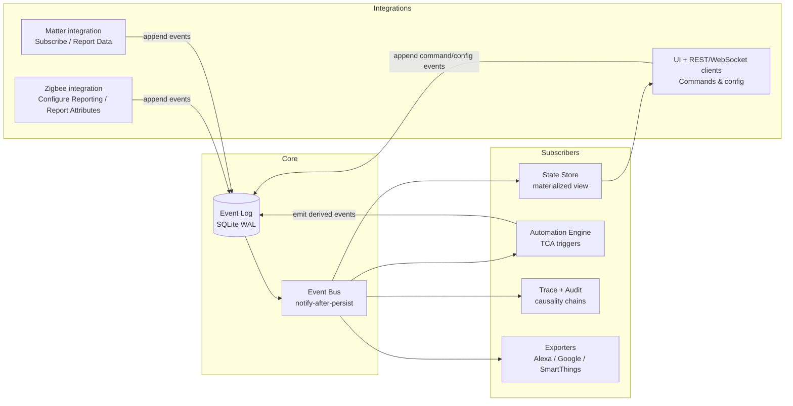
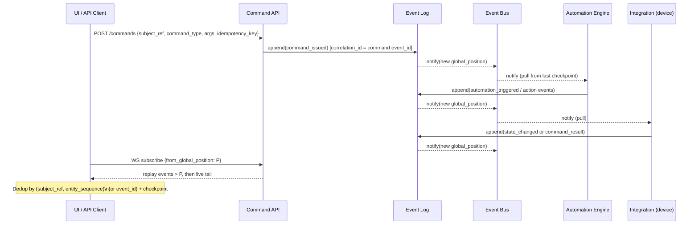

# Designing a Complete Event System for HomeSynapse

## Executive summary

HomeSynapse’s core docs already commit to an event-sourced architecture: an append-only Event Log as the source of truth, derived state via materialized views, and an in-process Event Bus that notifies subscribers only after durable persistence (write-ahead), with at-least-once delivery and subscriber-managed checkpoints and idempotency. fileciteturn29file0L1-L1 This baseline is materially different from most “smart home event systems,” which are typically (a) an in-memory event bus driving a state machine (Home Assistant), (b) a cloud state-cache update mechanism with strict latency SLAs (Alexa, Google), or (c) protocol-level attribute/event reporting subscriptions with negotiated intervals and transport-layer acknowledgments (Matter, Zigbee). citeturn6search3turn0search1turn6search2turn1search0turn2search47

A “complete” HomeSynapse event system therefore should not copy any single ecosystem’s surface API; instead it should (1) preserve the event-sourcing invariants and envelope described in HomeSynapse Core, (2) expose durable, replayable, filterable streams to internal subsystems and external clients, and (3) integrate protocol reporting/subscription models (Zigbee/Matter/Thread) and cloud “state reporting” models (Alexa/Google/SmartThings) as *exporters* and *ingesters* around the central log. fileciteturn29file0L1-L1 citeturn1search0turn2search47turn0search1turn6search2turn1search2

Key design decisions recommended for HomeSynapse:

- Treat the Event Log + strict Event Envelope as the only canonical interface between subsystems; everything else (UI state, automations, integrations, cloud exports) is a projection/subscriber. fileciteturn29file0L1-L1  
- Provide two external consumption APIs: (a) **pull + checkpoint** (HTTP query by `global_position` / `entity_sequence`) and (b) **push-notify** (WebSocket/SSE that still preserves replay by allowing resume from a checkpoint). This combines HomeSynapse’s durability model with the developer ergonomics seen in Home Assistant and openHAB. citeturn0search0turn2search0  
- Make event filtering first-class (subject refs, event types, capability/attribute paths, and “state-change-only” semantics), borrowing the best parts of SmartThings’ capability subscriptions and Home Assistant’s `subscribe_events` while retaining strict authorization. citeturn1search2turn0search0  
- Build protocol adapters that translate Zigbee attribute reporting (Configure Reporting / Report Attributes) and Matter Subscribe/Report interactions into HomeSynapse `state_changed` style domain events, with explicit deduplication and ordering rules. citeturn2search47turn1search0  
- For cloud ecosystems: implement exporters that translate internal events into Alexa ChangeReport and Google Report State—treating their “events” as remote cache update APIs with timing requirements (e.g., Alexa’s 3-second expectation). citeturn0search1turn6search2  

Assumptions (explicitly required by the prompt): HomeSynapse has no specified performance targets, deployment scale, or runtime constraints; recommendations below therefore prefer designs that degrade gracefully from “single box in a home” to “multi-tenant / multi-home” later, without forcing an external broker today. fileciteturn29file0L1-L1

## HomeSynapse foundations from the specified core docs

The HomeSynapse Core glossary defines an event-sourced model where:

- **Events are immutable facts** recorded in an **append-only Event Log**; **state is derived**, not authoritative. fileciteturn29file0L1-L1  
- The Event Log is stored in **SQLite** with **WAL mode**, with both per-entity ordering (via `entity_sequence`) and a global ordering (via a global position such as SQLite `rowid`). fileciteturn29file0L1-L1  
- The **Event Bus** is explicitly **not an external broker**; it is an **in-process pub/sub notification mechanism built atop the Event Log**, delivering events only after persistence (write-ahead) and providing **at-least-once delivery**. fileciteturn29file0L1-L1  
- Subscribers maintain their own checkpoint (by global position or per-entity sequence) and must be idempotent because duplicate deliveries are allowed/expected. fileciteturn29file0L1-L1  
- An **Event Envelope** is defined with required identity, ordering, and payload fields and optional causality/actor fields. fileciteturn29file0L1-L1  

The Identity and Addressing model reinforces that stable, opaque identifiers (references) are the binding keys across automation, events, and permissions (rather than human-readable names). fileciteturn27file0L1-L1 This is an important divergence from Home Assistant’s `domain.object_id` style identifiers (explicitly criticized in the glossary as fragile under rename and often used as binding keys). fileciteturn29file0L1-L1 citeturn0search0turn6search7

Implication: Your “complete event system” design should treat the envelope + log semantics as **non-negotiable invariants** and treat everything else (transport protocol, subscription API, filtering UI, integrations) as constrained by those invariants.

## Comparative analysis across ecosystems and platforms

Smart home “event systems” fall into three clusters, each with distinct tradeoffs:

- **Local runtime event buses** driving internal state machines and automations: Home Assistant, openHAB, Domoticz. citeturn6search3turn2search0turn3search0  
- **Cloud ecosystems** where “events” are primarily state synchronization operations to maintain a cloud-side model: Alexa and Google; SmartThings also strongly resembles this with webhook deliveries and subscription APIs. citeturn0search1turn6search2turn1search2  
- **Protocol ecosystems** where events are attribute/event reports in negotiated subscriptions or configured reporting: Matter, Zigbee; Thread is the IP-based mesh transport often used for Matter but isn’t itself the application event model. citeturn1search0turn2search47turn5search0  

The table below summarizes key attributes that matter for HomeSynapse’s design goals (durability, replay, filtering, developer ergonomics, and local-first security).

| Platform / ecosystem | Event model & transport | Filtering & subscription model | Guarantees, replay, ordering | Security / auth | Notable flaws / tradeoffs for HomeSynapse to learn from |
|---|---|---|---|---|---|
| **entity["organization","Home Assistant","open-source home automation"]** | In-process Event Bus drives core; WebSocket API can stream events (`subscribe_events`) and allows firing events (`fire_event`). citeturn6search3turn0search0 | Subscribe to all or specific event types via WebSocket; multiple event types require multiple subscriptions. citeturn0search0 | Primarily push over WebSocket; event bus is central but not defined as a durable replay log; state machine fires `state_changed`. citeturn6search3turn0search0 | WebSocket authentication handshake; uses tokens/HA auth model. citeturn0search0 | Great ergonomics and flexibility (event type is a string, JSON-serializable data) but weaker “replayable stream” semantics by default; historically had performance pitfalls with broad subscriptions (e.g., `time_changed` pattern removed). citeturn6search7turn6search8 |
| **entity["company","Amazon Alexa","voice assistant ecosystem"]** | Cloud directives + asynchronous event gateway; state changes reported via `Alexa.ChangeReport`; state queried via `ReportState`/`StateReport`. citeturn0search1turn0search2 | Subscription-like behavior configured at discovery: `proactivelyReported` determines what must be reported. citeturn0search1 | Tight latency expectation: ChangeReport expected quickly (documented as within ~3 seconds); retries advised on certain HTTP errors. citeturn0search1turn0search11 | Uses per-customer tokens/authorization in event scope; requires permissions to send events to the event gateway. citeturn0search1turn0search2 | “Eventing” is fundamentally cloud state-cache correctness + SLA management; race conditions addressed via `timeOfSample`. HomeSynapse should treat Alexa export as a specialized subscriber with strict scheduling and retry semantics. citeturn0search1 |
| **entity["organization","Google Home","smart home platform"]** / **entity["organization","Google Assistant","voice assistant"]** | Cloud intents (`SYNC`, `QUERY`, `EXECUTE`) plus explicit “Report State” calls to update Home Graph. citeturn6search2 | Report State is per-trait; platform overwrites the stored trait state with the last reported values. citeturn6search2 | Home Graph only stores state sent via Report State; EXECUTE/QUERY responses aren’t stored; reliability depends on implementer consistently reporting. citeturn6search2turn6search1 | Cloud OAuth/service auth; HomeGraph API enabled by developer. citeturn6search2 | Treat as “cloud projection API,” not a general pub/sub event bus; forcing complete trait snapshots reduces ambiguity but can increase payload sizes and requires careful exporter design. citeturn6search2 |
| **entity["organization","Apple HomeKit","apple smart home framework"]** | Local controller-accessory model; apps can register for characteristic notifications (`enableNotification(true)`); automations represented as event triggers (HMEventTrigger). citeturn1search12turn1search3 | Subscription is per characteristic that supports event notifications; automation triggers combine events + predicates. citeturn1search12turn1search3 | HAP event policy: notification registration does not persist across sessions; coalescing recommended; notifications delivered only to registered characteristics. citeturn1search44 | Requires controller to establish HAP session; HomeKit uses strong pairing/security model (details depend on accessory protocol/HAP). citeturn1search44 | Strong local security and clear “subscription does not persist” semantics; for HomeSynapse, the lesson is to separate “session subscriptions” (ephemeral) from “durable replay” (checkpoint-based) and be explicit about both. citeturn1search44 |
| **entity["company","Samsung SmartThings","smart home platform"]** | Webhook subscriptions: SmartApps receive HTTP POST on subscribed device/capability events; additionally enterprise eventing uses sinks + filters with batched events. citeturn1search2turn1search6 | Fine-grained subscriptions by device/component/capability/attribute with options like `stateChangeOnly`; capability subscriptions can cover all devices in a location. citeturn1search2turn1search6 | Delivery as POST requests; enterprise API shows batching; replay semantics are not framed as a durable consumer checkpoint in these docs. citeturn1search6turn1search2 | OAuth-style platform auth; installed app identity ties subscriptions to an app instance. citeturn1search2 | Excellent filtering ergonomics; HomeSynapse should adopt similar capability/attribute filters (but implement with durable checkpoints and local-first authorization). citeturn1search2 |
| Zigbee | Attribute reporting configured by “Configure Reporting” and delivered by “Report Attributes”; reporting intervals and triggers are configured per attribute/cluster. citeturn2search47turn2search3 | Filters are effectively “configured reporting records” per attribute; clients can choose min/max reporting intervals and reportable change (spec-dependent). citeturn2search47turn2search3 | Report delivery follows protocol/link semantics; configure reporting has explicit response semantics; ordering is per device/link, not global. citeturn2search47turn2search3 | Zigbee security and link-layer behavior are separate from app-level eventing; often coordinated via a hub/coordinator. citeturn2search47 | Good lesson in *bandwidth/energy-aware event emission* (don’t publish every raw change); HomeSynapse should support rate limits, coalescing, and “state-change-only” projections at ingestion time. citeturn2search47 |
| Thread | IPv6-based mesh transport; “eventing” is not an application-layer model but Thread impacts latency and reliability for Matter-over-Thread devices. citeturn5search0turn5search23 | N/A (transport). Border routers connect Thread mesh to other IP networks. citeturn5search3 | Thread materials advertise self-healing meshes, “no single point of failure,” and low latency targets (e.g., <100ms in Thread overview materials). citeturn5search0turn5search23 | Thread emphasizes secure connectivity; details depend on Thread security architecture and commissioning. citeturn5search1turn5search23 | For HomeSynapse: treat Thread as a “network substrate” that can make subscription-driven protocols (Matter) feasible locally; don’t conflate it with an app event bus. citeturn5search0 |
| Matter | Interaction Model supports Read and Subscribe transactions; Subscribe negotiates min/max reporting intervals and sends periodic Report Data; subscriber ACKs via Status Response unless suppressed. citeturn1search0turn1search1 | Filters are attribute/event paths specified in Subscribe Request; subscriptions are unicast; termination if no report within `max interval`, or explicit INACTIVE_SUBSCRIPTION. citeturn1search0turn1search1 | Built-in subscription lifecycle; ordering is within the subscription stream; device must support a minimum number of subscriptions/paths per spec limits. citeturn1search5turn1search0 | Matter security is fabric-based; subscription semantics operate within secure sessions. citeturn1search5turn1search0 | Strong model for negotiated cadence and backpressure; HomeSynapse should mirror this at its API boundary via “min/max interval” and server-side coalescing for hot entities. citeturn1search0 |
| **entity["organization","openHAB","open-source home automation"]** | WebSocket API provides direct access to Event Bus; JSON messages; default sends all events; can configure subset at runtime. citeturn2search0 | Runtime-configurable subset; offers source filtering to avoid echo; supports sending only certain event types back (ItemStateEvent/ItemCommandEvent). citeturn2search0 | Push via WebSocket; includes keepalive guidance (idle timeout ~10s; recommend heartbeat) and explicit error messages on malformed events. citeturn2search0 | Requires access token; supports passing via subprotocol header (browser-friendly) or query parameter. citeturn2search0 | Good operational details (heartbeat, error acks); HomeSynapse should include equally explicit connection lifecycle requirements, plus durable resume. citeturn2search0 |
| **entity["organization","Domoticz","home automation system"]** | Event system triggers scripts on device/variable/time/security triggers; time scripts run every minute; device scripts on updates; scripts block (Domoticz waits for completion). citeturn3search0 | Trigger scope is coarse (device/time/etc.); dzVents improves trigger targeting and performance via structured scripting model and triggers. citeturn3search1turn3search0 | No “event streaming API” focus; primary guarantee is serialized script execution (which becomes a throughput limiter). citeturn3search0 | Depends on Domoticz runtime/auth configuration; doc focus is scripting throughput and safety. citeturn3search0 | Cautionary example: synchronous single-thread script execution can throttle the whole system. HomeSynapse should isolate subscribers and enforce backpressure and timeouts. citeturn3search0 |
| **entity["organization","Node-RED","flow-based programming tool"]** | Event-driven flow runtime passing “messages” (JS objects) between nodes; messages commonly carry `payload`; runtime adds `_msgid` for tracing. citeturn4search0turn4search9 | Filtering/routing typically via message properties (`topic`, etc.); message design guidance discourages nodes from mutating unrelated properties. citeturn4search1turn4search0 | Message delivery is runtime-dependent; the message model isn’t a durable log by default; traceability relies on `_msgid` and debug tooling. citeturn4search0 | Security is deployment-specific; Node-RED docs here focus on message semantics, not auth. citeturn4search0 | Developer ergonomics benchmark: inspectability and consistent message conventions. HomeSynapse should provide equally strong tracing fields and tooling (correlation/causation IDs, actor, origin). fileciteturn29file0L1-L1 citeturn4search0 |

## Recommended design decisions for HomeSynapse

This section proposes a full system design that matches HomeSynapse’s documented invariants while importing the best proven ideas from other systems.

### Architecture and boundaries

HomeSynapse should be designed as a *log-centric core* with adapters at the edges:

- Ingestion edges: protocol integrations (Zigbee/Matter/etc.) and local UI/API actions convert external signals into internal, canonical Events. citeturn2search47turn1search0turn0search0  
- Core: Event Log + Event Bus + Projection subscribers (state store, automation engine, analytics, notification). fileciteturn29file0L1-L1  
- Export edges: voice assistants/cloud platforms consume internal events and publish their own required “state reports” (Alexa ChangeReport, Google Report State). citeturn0search1turn6search2  

This cleanly separates (a) *canonical facts* from (b) interchangeable IO strategies, and gives you replay, auditability, and debuggability as first-class features rather than add-ons. fileciteturn29file0L1-L1

### Event model, envelope, and schemas

HomeSynapse should keep the envelope described in its glossary as the platform “ABI” between subsystems: stable IDs, ordering, causality, and payload as JSON with tolerant evolution. fileciteturn29file0L1-L1 This aligns with:

- Node-RED’s emphasis on consistent message structure and traceability fields (but HomeSynapse should center on event IDs + causal links instead of `_msgid`). citeturn4search0  
- Alexa/Google’s emphasis on explicit timestamps/causes to avoid race conditions and stale cloud caches (HomeSynapse’s `event_time` and causal fields can feed such exporters). citeturn0search1turn6search2  

Recommended additions to the HomeSynapse envelope (compatible with the glossary’s “schema evolution tolerates unknown fields” approach): fileciteturn29file0L1-L1

- `schema_version` (integer): version of the envelope schema.
- `payload_schema` (string) and `payload_version` (integer): optional, allowing independent evolution of payload types.
- `content_hash` (optional): hash of canonicalized payload to help with dedup and tamper detection in exports.
- `trace_flags` (optional): a small bitfield to request/disable expensive trace capture.

### Subscription APIs: unify durability with developer ergonomics

A complete event system needs both *streaming* and *replayable querying*.

Borrowing API ergonomics from Home Assistant and openHAB while fixing their durability gaps implies:

- **WebSocket streaming** for interactive clients (dashboards, devtools, mobile apps). Home Assistant’s WebSocket API provides a clear precedent: authenticate handshake; subscribe by event type; server pushes event messages; and it supports feature negotiation such as message coalescing. citeturn0search0  
- **Explicit keepalive and error signaling**: openHAB documents idle timeouts and recommends heartbeat messages; it also specifies how errors are returned for malformed messages. citeturn2search0  
- **Resume-from-checkpoint semantics** by default: unlike HA/openHAB, HomeSynapse should let clients say “start at global_position N” (or “latest”), and the server should replay from the log and then switch to live tailing. This is consistent with HomeSynapse’s subscriber checkpoint model. fileciteturn29file0L1-L1  

Filtering should be *richer than “event_type only”*, inspired by SmartThings’ device/capability/attribute subscriptions and their `stateChangeOnly` flag. citeturn1search2 In a HomeSynapse-native model, filters should support:

- `subject_ref` (one or many), plus hierarchical “grouping subjects” like area/label resolved at subscription time (deterministic binding semantics already appear in the glossary’s label resolution rule). fileciteturn29file0L1-L1  
- `event_type` allowlist/denylist. fileciteturn29file0L1-L1  
- Optional `capability_id` and `attribute_key` filtering for state change payloads (a “projection filter” rather than raw event-type filter).  
- `state_change_only` semantics: don’t emit if projected state is identical (critical for noisy protocols and to mirror SmartThings’ subscription option). citeturn1search2  
- `min_interval_ms` / `max_interval_ms`: similar to Matter’s negotiated subscription cadence, enabling automatic coalescing/backpressure. citeturn1search0  

### Delivery semantics: make “at-least-once, replayable” the default

HomeSynapse is explicitly at-least-once internally; designing external interfaces should make this property both useful and safe: fileciteturn29file0L1-L1

- **Ordering**
  - Guarantee ordering within a single `subject_ref` stream via `entity_sequence` (or subject-specific sequence) and provide best-effort ordering by `global_position` for cross-subject reads. fileciteturn29file0L1-L1  
- **Replay**
  - Any consumer can replay from a checkpoint, including UI clients—this is the key advantage over “pure push WebSocket.”  
- **Deduplication**
  - Canonical dedup keys: `(subject_ref, entity_sequence)` when available; otherwise `event_id` (ULID). fileciteturn29file0L1-L1  
  - Provide client guidance similar to HomeSynapse’s subscriber idempotency rule: if consumer has processed up to `global_position = P`, any replayed event ≤ P is a duplicate and should be ignored. fileciteturn29file0L1-L1  

### Rate limiting and backpressure

Comparative evidence strongly supports explicit rate controls:

- Alexa recommends retries and emphasizes low latency; high event load can cause 429/503 behaviors and must be handled. citeturn0search1turn0search11  
- Google warns that failing to implement Report State leads to QUERY polling load and degraded UX. citeturn6search1  
- Domoticz warns that slow scripts block throughput because scripts run synchronously and Domoticz waits for completion. citeturn3search0  
- Matter uses negotiated min/max intervals and terminates subscriptions when reports don’t arrive within the maximum interval. citeturn1search0  

HomeSynapse should therefore implement:

- Per-subscription backpressure: server may switch to “coalesced state snapshots” for high-frequency entities when the client falls behind (borrowing the idea of “coalesce messages” negotiation from Home Assistant). citeturn0search0  
- Per-producer rate limits: integrations should not be allowed to append unbounded high-frequency events without either aggregation or explicit configuration. This mirrors Zigbee’s reporting configuration and Matter’s negotiated interval model at an architectural level. citeturn2search47turn1search0  
- Admission control for expensive filters: e.g., label-to-entity resolution or wildcard filters should be resolved once at subscription time (as the glossary already suggests for label membership determinism). fileciteturn29file0L1-L1  

### Security and authorization

A complete event system needs security at two layers:

- **Transport security**: TLS for WebSocket/HTTP; secure local auth model.
- **Semantic authorization**: permission to *observe* events.

Cross-ecosystem lessons:

- openHAB explicitly requires an access token for WebSockets and supports browser-friendly token passing techniques. citeturn2search0  
- Alexa requires per-customer tokens/authorization in each event submission scope. citeturn0search1turn0search2  
- SmartThings ties subscriptions to an installed app instance and authorization scope; subscriptions can cover all devices in a location only if the app has broad permission. citeturn1search2  
- HomeKit notifications require an authenticated session and do not persist subscription state across sessions—this is an explicit security boundary. citeturn1search44  

HomeSynapse should align with its identity model: stable internal references, plus explicit roles/permissions. fileciteturn29file0L1-L1 fileciteturn27file0L1-L1 Concretely:

- Every event delivered to an external client must be filtered by what that client is authorized to read (e.g., entity/area permissions).
- Support “audit fidelity” by ensuring `actor_ref` and causality fields are available to authorized users for trace views, but redacted for less-privileged roles. fileciteturn29file0L1-L1  

### Extensibility and developer ergonomics

Home Assistant’s integration docs emphasize event flexibility (event types are strings; event data must be JSON-serializable) and provide helper APIs for listening efficiently. citeturn6search7turn6search6 SmartThings offers a very ergonomic capability/attribute subscription model. citeturn1search2 Node-RED focuses on simple message objects and strong inspectability tooling. citeturn4search0turn4search1

HomeSynapse can combine these into a cohesive developer experience by:

- Providing a typed SDK that code-generates payload structures for core event types while still allowing extension event types in a namespace (as the glossary indicates for integration-defined types). fileciteturn29file0L1-L1  
- Providing a built-in “event inspector” UI similar in spirit to Node-RED’s Debug node and Home Assistant’s event tools, but driven directly from the Event Log (with replay). citeturn4search0turn0search8  

## Reference schemas, APIs, and diagrams for HomeSynapse

### Architecture diagram



This preserves HomeSynapse’s documented “persist first, then notify” requirement and lets every subsystem be restartable with a checkpoint and replay. fileciteturn29file0L1-L1

### Suggested canonical Event Envelope (JSON Schema sketch)

```json
{
  "$schema": "https://json-schema.org/draft/2020-12/schema",
  "$id": "hs://schemas/event-envelope/1",
  "type": "object",
  "required": [
    "schema_version",
    "event_id",
    "event_type",
    "ingest_time",
    "subject_ref",
    "global_position",
    "payload"
  ],
  "properties": {
    "schema_version": { "type": "integer", "minimum": 1 },

    "event_id": { "type": "string", "description": "ULID (string form)"},
    "event_type": { "type": "string" },

    "event_time": { "type": ["string", "null"], "format": "date-time" },
    "ingest_time": { "type": "string", "format": "date-time" },

    "subject_ref": { "type": "string", "description": "ULID of Entity/Device/etc." },

    "entity_sequence": { "type": ["integer", "null"], "minimum": 0 },

    "global_position": { "type": "integer", "minimum": 0 },

    "actor_ref": { "type": ["string", "null"] },

    "correlation_id": { "type": ["string", "null"] },
    "causation_id": { "type": ["string", "null"] },

    "origin": {
      "type": ["string", "null"],
      "enum": ["device", "user", "automation", "system", "import", null]
    },

    "payload_schema": { "type": ["string", "null"] },
    "payload_version": { "type": ["integer", "null"], "minimum": 1 },

    "payload": { "type": "object", "additionalProperties": true }
  }
}
```

This is a faithful reinforcement of the glossary’s envelope fields plus explicit schema versioning knobs to support long-lived payload evolution in a multi-integration ecosystem. fileciteturn29file0L1-L1

### Event flow diagram with dedup, replay, and causality



This explicitly blends HomeSynapse’s internal model (checkpointed pull after notify) with developer-friendly streaming and replay. fileciteturn29file0L1-L1

### External APIs: examples

#### WebSocket subscribe with resume and coalescing

This is conceptually similar to Home Assistant’s `subscribe_events` command and feature negotiation, but upgraded to durable resume. citeturn0search0

```json
// Client -> Server
{
  "id": 1,
  "type": "supported_features",
  "features": { "coalesce_messages": 1 }
}
```

```json
// Client -> Server
{
  "id": 2,
  "type": "subscribe",
  "from_global_position": 120394,
  "filter": {
    "event_types": ["state_changed", "availability_changed"],
    "subject_refs": ["01J2...ULID...", "01J2...ULID..."],
    "state_change_only": true,
    "min_interval_ms": 100,
    "max_interval_ms": 5000
  }
}
```

```json
// Server -> Client
{
  "id": 2,
  "type": "result",
  "success": true,
  "result": { "subscription_id": "sub_abc123" }
}
```

```json
// Server -> Client (batched replay or coalesced live)
{
  "type": "events",
  "subscription_id": "sub_abc123",
  "events": [
    { "event_id": "01J2...", "global_position": 120395, "event_type": "state_changed", "payload": { "...": "..." } }
  ]
}
```

#### HTTP event queries (pull API)

A replayable pull API lets low-complexity clients avoid WebSockets and still be correct after outages.

```http
GET /api/events?from_global_position=120395&limit=500&event_type=state_changed
Authorization: Bearer <token>
```

```json
{
  "from_global_position": 120395,
  "next_global_position": 120895,
  "events": [
    { "event_id": "01J2...", "global_position": 120396, "event_type": "state_changed", "payload": { } }
  ]
}
```

This directly supports the internal subscriber checkpoint model described in the HomeSynapse glossary. fileciteturn29file0L1-L1

## Risks, tradeoffs, and migration/testing strategy

The main tradeoffs visible across ecosystems:

- **Push-only streaming is ergonomic but lossy across disconnects** (typical WebSocket event bus use). Home Assistant’s core event bus + WebSocket streaming is excellent for UI responsiveness, but replay semantics are not the default mental model. citeturn6search3turn0search0  
- **Durable logs and replay increase design complexity** (schema evolution, storage growth, retention, projection rebuilds). HomeSynapse explicitly accepts this complexity to gain explainability, determinism, and crash safety. fileciteturn29file0L1-L1  
- **Cloud ecosystems impose external correctness/latency contracts**: Alexa expects fast ChangeReports and documents retry behavior and `timeOfSample` guidance to avoid race conditions; Google requires Report State to prevent polling load and stale UI. citeturn0search1turn6search2turn6search1  
- **Protocol-level reporting is inherently cadence-based** (Zigbee Configure Reporting; Matter min/max interval subscriptions). A HomeSynapse ingestion layer that treats every raw report as “fire an event immediately” will either overwhelm the system or create noisy automation behavior; cadence controls and coalescing are structurally necessary. citeturn2search47turn1search0  
- **Synchronous script execution is a throughput killer**: Domoticz’s warning that scripts block the system is a concrete anti-pattern. HomeSynapse subscribers should be isolated and bounded (timeouts, queue depth, circuit breakers). citeturn3search0  

Testing and verification recommendations (designed to be feasible without assuming runtime/language constraints):

- **Schema compatibility tests**: validate that new payload fields do not break old consumers (HomeSynapse’s tolerant JSON parsing approach is already implied in the glossary). fileciteturn29file0L1-L1  
- **Idempotency tests for subscribers**: inject duplicate events and assert projections do not diverge (mirrors the glossary’s idempotency expectation). fileciteturn29file0L1-L1  
- **Backpressure and overload tests**: simulate Zigbee/Matter “event bursts” and confirm the system either coalesces or rate-limits without dropping durability. Zigbee reporting and Matter subscriptions provide real-world burst patterns to emulate. citeturn2search47turn1search0  
- **Exporter contract tests**:
  - Alexa: ensure ChangeReports include required property contexts and that delivery retries follow documented guidance under transient HTTP failures. citeturn0search1turn0search11  
  - Google: ensure Report State sends complete trait payloads and is invoked even when EXECUTE/QUERY already returned state. citeturn6search2turn6search1  

Migration strategy (from other platforms) should treat “imported state/history” as a special origin:

- Use `origin = import` (already in glossary) and preserve original timestamps where possible (`event_time`) while recording `ingest_time` when imported. fileciteturn29file0L1-L1  
- Prefer importing as events rather than directly writing state, to preserve the “no hidden state” property and allow later projection rebuilds. fileciteturn29file0L1-L1  

Finally, open questions (must be resolved later because the prompt specifies no constraints): default retention periods, acceptable replay windows for UI clients, and target throughput on constrained hardware. The design above intentionally leaves these as configuration knobs (retention policies, subscription interval negotiation, and coalescing) rather than hard-coded assumptions, consistent with Matter’s negotiated intervals and Zigbee’s configurable reporting. citeturn1search0turn2search47